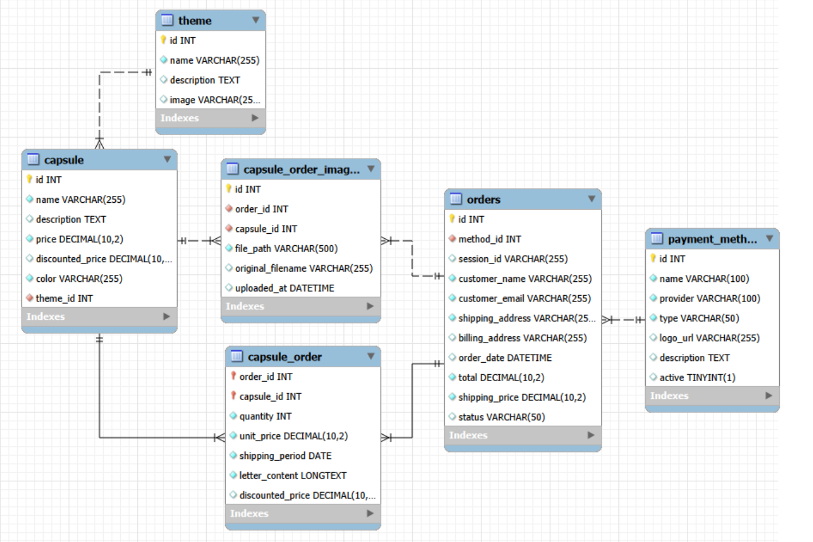

<h1 align="center">  Chronobox – Backend API </h1>

Chronobox è il backend di un e-commerce dedicato alla vendita di **capsule del tempo**.  
Il progetto espone un set di API REST utilizzate dal frontend per accedere e gestire capsule, temi, ordini e metodi di pagamento.

Il backend è realizzato con **Node.js + Express** e utilizza **MySQL** come database.

## API principali
Tutte le risorse del progetto includono le operazioni standard CRUD (creazione, lettura, aggiornamento ed eliminazione).

- **/api/capsules**  
  Gestisce le capsule preimpostate disponibili nel sito e le relative capsule correlate.

- **/api/themes**  
  Gestisce i temi collegati alle capsule.

- **/api/payment-methods**  
  Gestisce i metodi di pagamento disponibili sul sito.

- **/api/orders**  
  Gestisce gli ordini effettuati dagli utenti.

---

## Struttura del backend

Il progetto è organizzato nel seguente modo:

- **routers/** → file che definiscono i vari router dell’API  
- **controllers/** → logica delle CRUD
- **data/** → file dedicato alla connessione con il database MySQL "db_chronobox"  
- **app.js** → registrazione dei router e avvio del server  

Le capsule sono **preimpostate**, quindi non è prevista alcuna personalizzazione da parte dell’utente.

---

## Schema entità–relazione

Lo schema E-R utilizzato dal backend è il seguente:

## Frontend del progetto

La parte frontend è disponibile nella repository dedicata:  
https://github.com/Matteo-Ciardi/fe-chronobox.git

<h2 align="center">  Chronobox – Documentazione API </h2>

## Crud - Capsules
https://documenter.getpostman.com/view/48540573/2sB3WwrxkH

## Crud - Capsule New Arrivals
https://documenter.getpostman.com/view/48540573/2sB3Wwrxpf

## Crud - Capsules Most Popular

## Crud - Orders

## Crud - Payment Methods
https://documenter.getpostman.com/view/48540573/2sB3Wwrxu9
